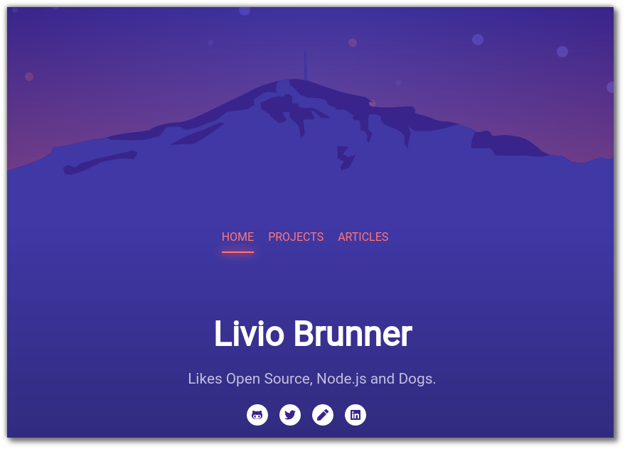

<!-- AUTO-GENERATED-CONTENT:START (STARTER) -->
<p align="center">
  <a href="https://www.gatsbyjs.org">
    
  </a>
</p>
<h1 align="center">
  brunnerliv.io
</h1>

<p align="center">
  
</p>

## 🚀 Quick start

Make sure you have NodeJS and Yarn installed.

```bash
git clone https://github.com/BrunnerLivio/brunnerliv.io.git
cd brunnerliv.io
yarn
npm run start
```

## Credits

Thanks Tanja for the [Rigi](https://www.rigi.ch/) SVG image <3