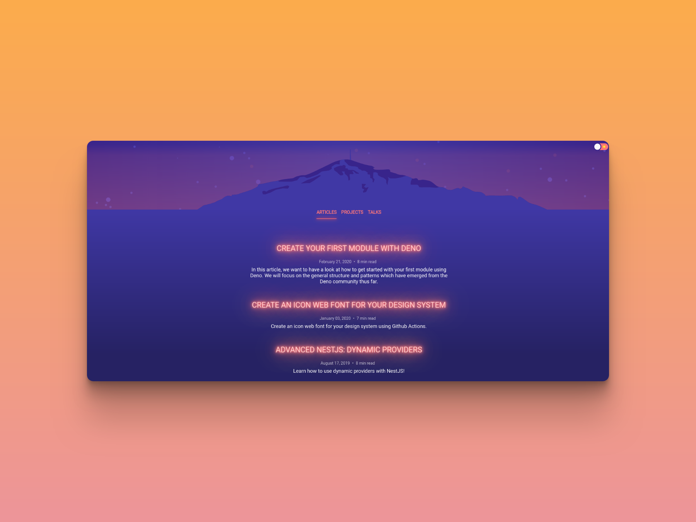

<!-- AUTO-GENERATED-CONTENT:START (STARTER) -->
<p align="center">
  <a href="https://www.gatsbyjs.org">
    
  </a>
</p>
<h1 align="center">
  brunnerliv.io
</h1>

<p align="center">
  
</p>

## 🚀  Quick start

Make sure you have NodeJS installed.

```bash
git clone https://github.com/BrunnerLivio/brunnerliv.io.git
cd brunnerliv.io
npm i
npm run start
```

## 🦕  Deno?! 

```bash
deno https://brunnerliv.io/me.ts
```

## Credits

- Dark mode color scheme inspired by [Reddit Account Analyser](https://www.reddit.com/r/web_design/comments/5t8qfg/gif_of_a_reddit_account_analyser_im_building_with/)
- Page structure inspired by [overreacted.io](https://overreacted.io/)
- Light/Dark mode switch adopted from [overreacted.io](https://overreacted.io/)
- Header stars technique adopted from [getgrav.org](https://getgrav.org/)
- Mountain ([Rigi](https://www.rigi.ch/)) SVG image by my friend Tanja <3
- Built with [GatsbyJS](https://www.gatsbyjs.org/)